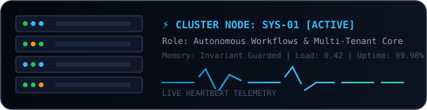
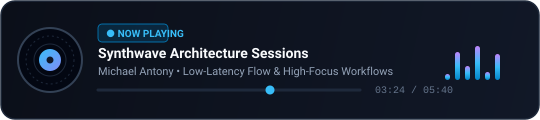

<p align="center">
  
</p>

# Hey 👋, I am Michael!

---

<p align="center">
  
</p>

### 🧑‍💻 About Me

I am a Software Engineer focused on designing and building mission-critical enterprise applications, domain-driven architectures (DDD), and resilient multi-tenant platforms where security, strict data invariants, and high reliability are non-negotiable.

Beyond web and mobile architectures, I specialize in workflow automation and low-level systems: from building robust RPA bots with Playwright, BullMQ, and Redis to solve complex portals and captchas, to developing desktop automation tools in C#/.NET leveraging native Win32 APIs and real-time screen analysis.

I actively integrate AI-assisted agentic workflows, Spec-Driven Development (SDD), and automated CI/CD pipelines to raise code quality, test effectiveness, and delivery velocity.

### ⚒️ Dev Stack

<p align="left">
  <a href="https://www.typescriptlang.org/" target="_blank" rel="noreferrer"></a>
  &nbsp;
  <a href="https://react.dev/" target="_blank" rel="noreferrer"></a>
  &nbsp;
  <a href="https://nodejs.org/" target="_blank" rel="noreferrer"></a>
  &nbsp;
  <a href="https://dotnet.microsoft.com/" target="_blank" rel="noreferrer"></a>
  &nbsp;
  <a href="https://dotnet.microsoft.com/" target="_blank" rel="noreferrer"></a>
  &nbsp;
  <a href="https://www.python.org/" target="_blank" rel="noreferrer"></a>
  &nbsp;
  <a href="https://www.postgresql.org/" target="_blank" rel="noreferrer"></a>
  &nbsp;
  <a href="https://redis.io/" target="_blank" rel="noreferrer"></a>
  &nbsp;
  <a href="https://playwright.dev/" target="_blank" rel="noreferrer"></a>
  &nbsp;
  <a href="https://www.docker.com/" target="_blank" rel="noreferrer"></a>
  &nbsp;
  <a href="https://tailwindcss.com/" target="_blank" rel="noreferrer"></a>
  &nbsp;
  <a href="https://git-scm.com/" target="_blank" rel="noreferrer"></a>
</p>

---

<h2 align="left">⚡ Telemetry &amp; System Station</h2>

<p align="center">
  
</p>

<p align="center">
  
</p>

---

<h2 align="left">🕹️ Interactive Arena: Tic-Tac-Toe</h2>

<p align="left">Challenge the architect! Click an open cell to challenge me (Player: ❌ vs Architect: ⭕):</p>

| Col 1 | Col 2 | Col 3 |
| :---: | :---: | :---: |
| [ ⭕ ](https://github.com/Mitchel2003/Mitchel2003/issues/new?title=ttt%7Cplay%7C0%2C0&body=I+challenge+you+with+this+move!) | [ ❌ ](https://github.com/Mitchel2003/Mitchel2003/issues/new?title=ttt%7Cplay%7C0%2C1&body=I+challenge+you+with+this+move!) | [ ⬜ (Play)](https://github.com/Mitchel2003/Mitchel2003/issues/new?title=ttt%7Cplay%7C0%2C2&body=I+challenge+you+with+this+move!) |
| [ ⬜ (Play)](https://github.com/Mitchel2003/Mitchel2003/issues/new?title=ttt%7Cplay%7C1%2C0&body=I+challenge+you+with+this+move!) | [ ❌ ](https://github.com/Mitchel2003/Mitchel2003/issues/new?title=ttt%7Cplay%7C1%2C1&body=I+challenge+you+with+this+move!) | [ ⭕ ](https://github.com/Mitchel2003/Mitchel2003/issues/new?title=ttt%7Cplay%7C1%2C2&body=I+challenge+you+with+this+move!) |
| [ ⬜ (Play)](https://github.com/Mitchel2003/Mitchel2003/issues/new?title=ttt%7Cplay%7C2%2C0&body=I+challenge+you+with+this+move!) | [ ⬜ (Play)](https://github.com/Mitchel2003/Mitchel2003/issues/new?title=ttt%7Cplay%7C2%2C1&body=I+challenge+you+with+this+move!) | [ ❌ (Win!)](https://github.com/Mitchel2003/Mitchel2003/issues/new?title=ttt%7Cplay%7C2%2C2&body=I+challenge+you+with+this+move!) |

---

<h2 align="left">⚡ Terminal Environment</h2>

```bash
mitchel@sys:~$ neofetch --profile
  /\_/\      OS: Linux / Windows (WSL2)
 ( o.o )     Kernel: High-Reliability Architecture
  > ^ <      Shell: zsh / powershell
             Editor: Neovim / VSCode
             Stack: TypeScript, C#/.NET, Node.js, Python, PostgreSQL, Docker
             Automation: Playwright, BullMQ, Redis, Win32 Native
             Status: Building mission-critical systems & resilient workflows
```

---

<h2 align="left">🏆 Contributions</h2>
<p align="center">
    <!--Streak-stats-->
  <a href="https://github.com/Mitchel2003?tab=repositories">
    
  </a>
    <!--Lapras-card-->
  <a href="https://lapras.com/public/KFSJXU0">
    
  </a>
</p>

---

<h2 align="left">📊 Github Analytics</h2>

<p align="center">
  <a href="https://github.com/Mitchel2003">
    <!--Most-used-lenguage-->
    
    <!--Github-stats-->
    
    <!--Trophies-stats-->
    
  </a>
</p>

---

<h2 align="left">🏙️ 3D Contribution City & 🐍 Snake</h2>

<div align="center">
  <picture>
    <source media="(prefers-color-scheme: dark)" srcset="https://raw.githubusercontent.com/Mitchel2003/Mitchel2003/main/profile-3d-contrib/profile-night-rainbow.svg" />
    <source media="(prefers-color-scheme: light)" srcset="https://raw.githubusercontent.com/Mitchel2003/Mitchel2003/main/profile-3d-contrib/profile-green-animate.svg" />
    
  </picture>
</div>

<br/>

<div align="center">
  <picture>
    <source media="(prefers-color-scheme: dark)" srcset="https://raw.githubusercontent.com/Mitchel2003/Mitchel2003/output/github-contribution-grid-snake-dark.svg" />
    <source media="(prefers-color-scheme: light)" srcset="https://raw.githubusercontent.com/Mitchel2003/Mitchel2003/output/github-contribution-grid-snake.svg" />
    
  </picture>
</div>

---

<h2 align="left" style="display: flex; justify-content: space-between; align-items: center;">
  📫 Connect with Me
  
</h2>

<p align="left">
  <a href="mailto:avilesmaicol.08@gmail.com">
    
  </a>
  <a href="https://linkedin.com/in/Mitchel2003" target="_blank">
    
  </a>
  <a href="https://github.com/Mitchel2003" target="_blank">
    
  </a>
</p>
